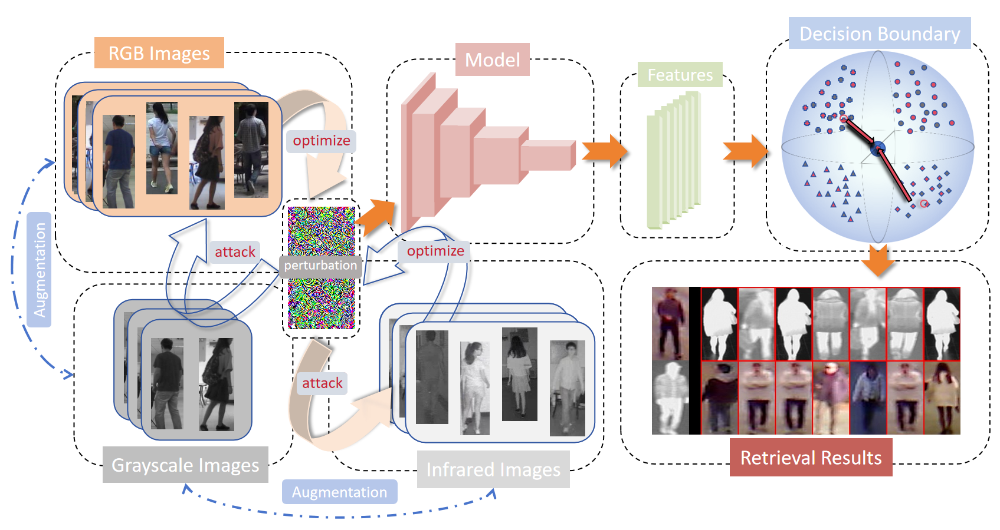
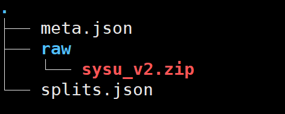

# Cross-Modality Perturbation Synergy Attack for Person Re-identification(The code will be gradually released. Once all subsequent work is completed, it will be fully released.)

Code for XXX2024 paper ``Cross-Modality Perturbation Synergy Attack for Person Re-identification (XXX 2024)".





## Requirements:
* python==3.7.9
* CUDA==11.2
* torch==1.3.1
* torchvision==0.2.1
* opencv_python==4.2.0.34
* metric_learn==0.5.0
* six==1.12.0
* h5py==2.9.0
* scipy==1.3.1
* numpy==1.17.2
* Pillow==7.2.0
* scikit_learn==0.23.2
* SYSU-MM01 and RegDB dataset.
* faiss-gpu==1.6.0

## Preparing Data

* Clone our repo

SYSU-MM01 (RegDB the same):
* Download "SYSU-MM01.zip".
* Create a new directory, rename it as "data".
* Create a directory called "raw" under "data" and put "SYSU-MM01.zip" under it.
* The final structure should like this (meta.json and splits.json are generated by our code, please ignore them):




## Run our code
 
XXXXX

If you find this code useful in your research, please consider citing:

```
@misc{gong2024crossmodality,
      title={Cross-Modality Perturbation Synergy Attack for Person Re-identification}, 
      author={Yunpeng Gong and Zhun Zhong and Zhiming Luo and Yansong Qu and Rongrong Ji and Min Jiang},
      year={2024},
      eprint={2401.10090},
      archivePrefix={arXiv},
      primaryClass={cs.CV}
}
```

## Acknowledgments

Our code is based on [Random Color Erasing](https://github.com/finger-monkey/Data-Augmentation),[UAP-Retrieval](https://github.com/theFool32/UAP_retrieval) and [LTA](https://github.com/finger-monkey/LTA_and_joint-defence)  
if you use our code, please also cite their paper.
```
@misc{RCE2024,
      title={Exploring Color Invariance through Image-Level Ensemble Learning}, 
      author={Yunpeng Gong and Jiaquan Li and Lifei Chen and Min Jiang},
      year={2024},
      eprint={2401.10512},
      archivePrefix={arXiv},
      primaryClass={cs.CV}
}
```
```
@inproceedings{Li_2019_ICCV,
    author = {Li, Jie and Ji, Rongrong and Liu, Hong and Hong, Xiaopeng and Gao, Yue and Tian, Qi},
    title = {Universal Perturbation Attack Against Image Retrieval},
    booktitle = {ICCV},
    year = {2019}
}
```
```
@inproceedings{colorAttack2022,
  title={Person re-identification method based on color attack and joint defence},
  author={Gong, Yunpeng and Huang, Liqing and Chen, Lifei},
  booktitle={Proceedings of the IEEE/CVF Conference on Computer Vision and Pattern Recognition},
  pages={4313--4322},
  year={2022}
}
```


## Contact Me

Email: fmonkey625@gmail.com

